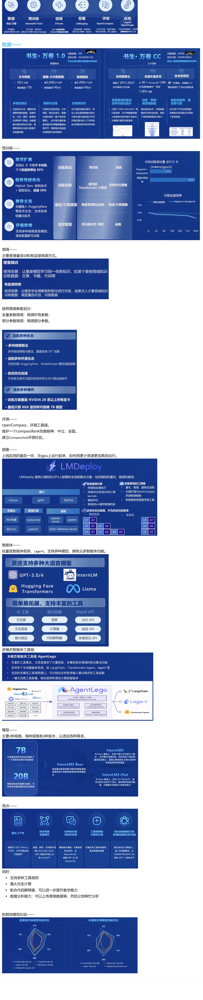

# InterLM2技术报告

这里主要总结关注几个我感兴趣的点：

1、对数据准备和提取，下了非常大的功夫。包括了text, code, and long-context data。因为数据质量对于预训练的结果至关重要。

2、采用SFT和COOLRLHF(自己提出的)使得模型对其我们人类的认知和价值观。

3、采用了GQA方法做长文本的训练。

4、在InerEvo框架上进行训练，这个框架帮助训练得到强大的并行训练的能力和效率。

5、模型结构遵循LLaMa，一是因为这个架构本身具有优越性，二是因为同类产品大多这个架构。

（技术报告还有很多值得看的地方，暂时先到这里）
