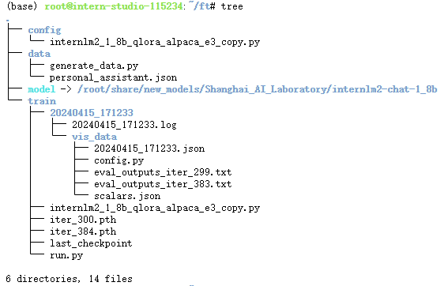
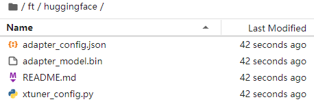
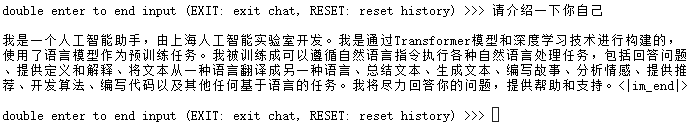
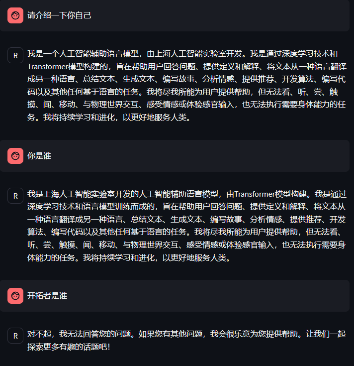

# 基础作业
## 训练自己的小助手认知（记录复现过程并截图）

对自己训练的小助手进行测试，运行微调的模型：
```bash
conda activate lmdeploy
lmdeploy chat /root/internlm2-chat-1_8b
```
得到的目录如图所示：

然后将pth格式文件转化为huggingfac格式文件，得到：

然后整合模型，使用xtuner进行对话：
> 微调似乎崩了！没能得到预期结果。



# 进阶作业
## 将自我认知的模型上传到 OpenXLab，并将应用部署到 OpenXLab
部署无外乎分为三个部分：服务端启动、客户端端口映射、打开web页面。  

## 复现多模态微调


更加详细的OpenXLab 部署教程：https://github.com/InternLM/Tutorial/tree/camp2/tools/openxlab-deploy