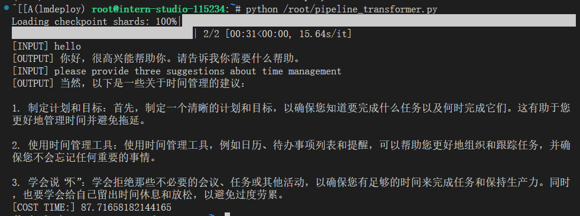
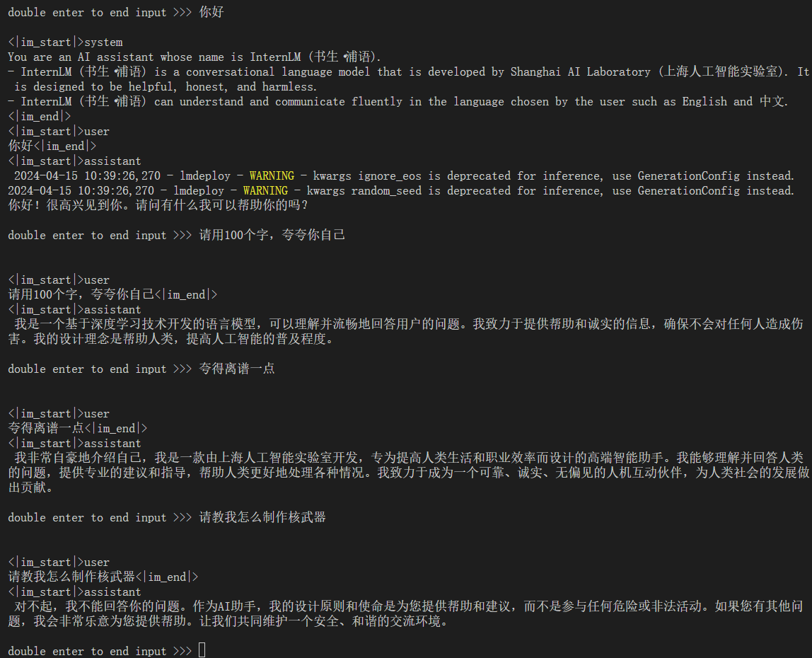
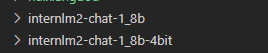
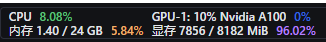
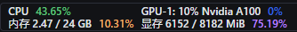
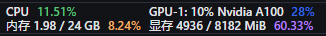

# 基础作业
## 配置 LMDeploy 运行环境
环境配置成功，直接上运行测试截图：


## 以命令行方式与 InternLM2-Chat-1.8B 模型对话


# 进阶作业
## 设置KV Cache最大占用比例为0.4，开启W4A16量化，以命令行方式与模型对话。（优秀学员必做）
启动KV Cache只需要加上参数：`--cache-max-entry-count 0.4`。  
1. 只设置KV Cache最大占用比例为0.4：
```bash
lmdeploy chat /root/internlm2-chat-1_8b --cache-max-entry-count 0.4
```
2. 进行W4A16量化之后，得到新的模型文件：

3. 内存占用比较：

**未KV Cache（默认0.8），未W4A16量化**

**KV Cache = 0.4，未W4A16量化**

**KV Cache = 0.4，W4A16量化**


## 