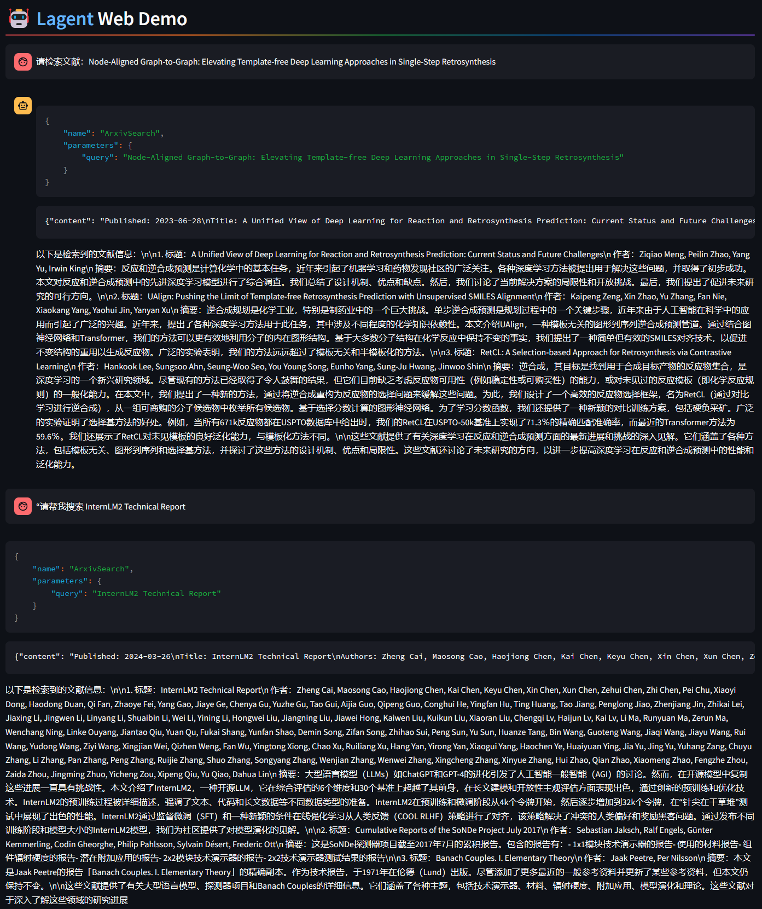
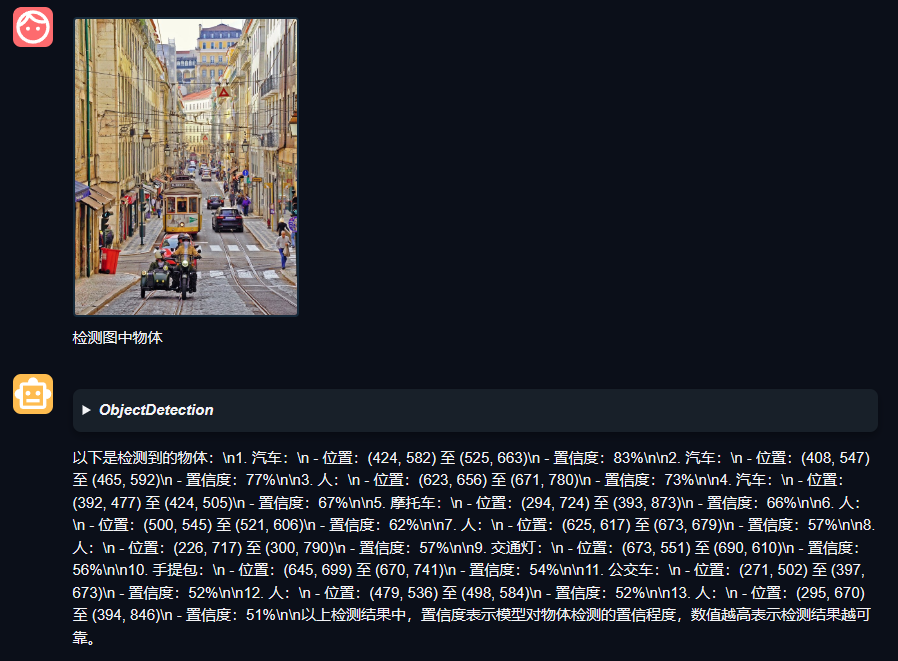
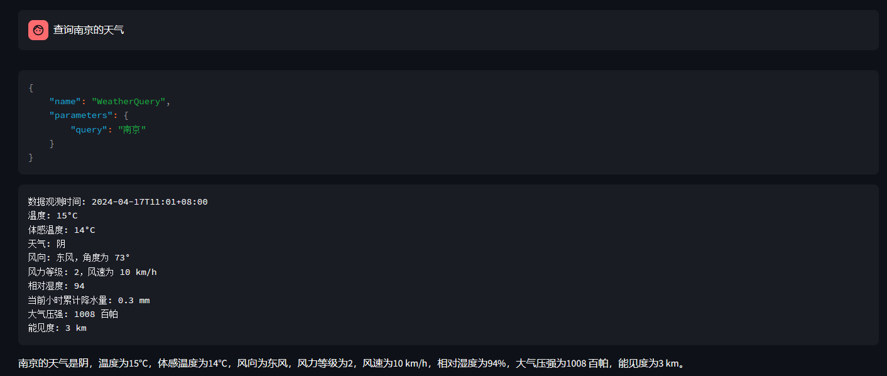
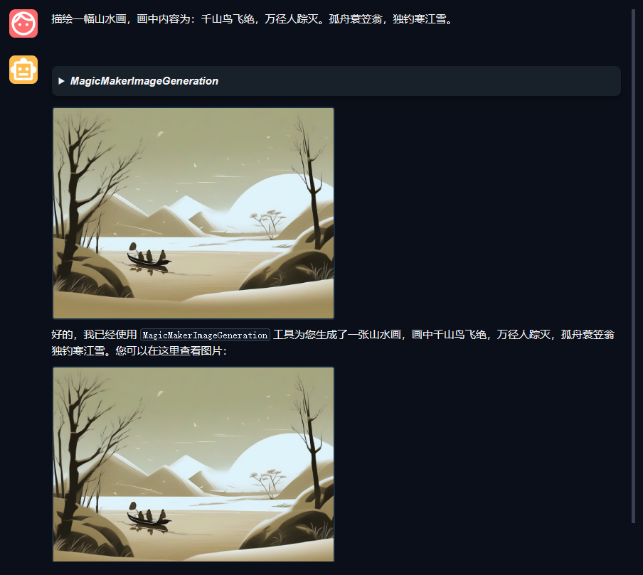

## 基础作业

1. 完成 Lagent Web Demo 使用
部署完成，对两个问题的回答如图。  
第一个问题我们要求找一篇具体的文献，文献名给出。智能体钱确实找到几篇相关文献，但是没有我们需要它找的文献。  
第二个问题就是教程中“请帮我搜索 InternLM2 Technical Report”，结果是OK的。

2. 完成 AgentLego 直接使用部分
直接检测结果：

   
## 进阶作业

1. 完成 AgentLego WebUI 使用(agentlego.md#2-作为智能体工具使用)。

1. 使用 Lagent 或 AgentLego 实现自定义工具并完成调用
使用Lagent自定义工具查询天气：

使用agentlego自定义工具绘图：
资料：

   - [用 Lagent 自定义工具](lagent.md#2-用-lagent-自定义工具)
   - [用 AgentLego 自定义工具](agentlego.md#3-用-agentlego-自定义工具)

## 大作业选题
### 算法方向
1. 在 Lagent 或 AgentLego 中实现 RAG 工具，实现智能体与知识库的交互。
<原神角色RAG + 智能体>