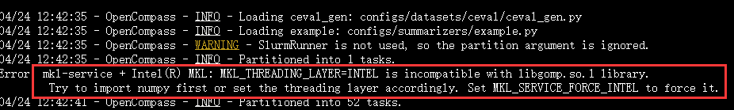

# 基础作业
使用 OpenCompass 评测 internlm2-chat-1_8b 模型在 C-Eval 数据集上的性能
配置环境 -》 准备评测数据集 -》 评测（脚本启动）
注：直接运行会报错

需要：
```bash
export MKL_SERVICE_FORCE_INTEL=1
```
命令解析
```
python run.py
--datasets ceval_gen \
--hf-path /share/new_models/Shanghai_AI_Laboratory/internlm2-chat-1_8b \  # HuggingFace 模型路径
--tokenizer-path /share/new_models/Shanghai_AI_Laboratory/internlm2-chat-1_8b \  # HuggingFace tokenizer 路径（如果与模型路径相同，可以省略）
--tokenizer-kwargs padding_side='left' truncation='left' trust_remote_code=True \  # 构建 tokenizer 的参数
--model-kwargs device_map='auto' trust_remote_code=True \  # 构建模型的参数
--max-seq-len 1024 \  # 模型可以接受的最大序列长度
--max-out-len 16 \  # 生成的最大 token 数
--batch-size 2  \  # 批量大小
--num-gpus 1  # 运行模型所需的 GPU 数量\
--reuse latest # 指定时间撮，默认当前时间戳。复用之前时间戳的内容可以加快速度。
--debug # 日志信息在终端显示。不指定这个参数则这些信息在时间戳的logs/下
```
输出文件

```shell
config/ : 总结所有的配置信息的配置文件
logs/ ： 日志信息
predictions/ ： 模型的预测结果
results/ 评测的结果
summary/ 对结果进行总结，txt和csv形式总结
```
结果
```bash
	dataset	version	metric	mode	opencompass.models.huggingface.HuggingFace_Shanghai_AI_Laboratory_internlm2-chat-1_8b
1	ceval-computer_network	db9ce2	accuracy	gen	47.37
2	ceval-operating_system	1c2571	accuracy	gen	47.37
3	ceval-computer_architecture	a74dad	accuracy	gen	23.81
4	ceval-college_programming	4ca32a	accuracy	gen	13.51
5	ceval-college_physics	963fa8	accuracy	gen	42.11
6	ceval-college_chemistry	e78857	accuracy	gen	33.33
7	ceval-advanced_mathematics	ce03e2	accuracy	gen	10.53
8	ceval-probability_and_statistics	65e812	accuracy	gen	38.89
9	ceval-discrete_mathematics	e894ae	accuracy	gen	25.00
10	ceval-electrical_engineer	ae42b9	accuracy	gen	27.03
11	ceval-metrology_engineer	ee34ea	accuracy	gen	54.17
12	ceval-high_school_mathematics	1dc5bf	accuracy	gen	16.67
13	ceval-high_school_physics	adf25f	accuracy	gen	42.11
14	ceval-high_school_chemistry	2ed27f	accuracy	gen	47.37
15	ceval-high_school_biology	8e2b9a	accuracy	gen	26.32
16	ceval-middle_school_mathematics	bee8d5	accuracy	gen	36.84
17	ceval-middle_school_biology	86817c	accuracy	gen	80.95
18	ceval-middle_school_physics	8accf6	accuracy	gen	47.37
19	ceval-middle_school_chemistry	167a15	accuracy	gen	80.00
20	ceval-veterinary_medicine	b4e08d	accuracy	gen	43.48
21	ceval-college_economics	f3f4e6	accuracy	gen	32.73
22	ceval-business_administration	c1614e	accuracy	gen	36.36
23	ceval-marxism	cf874c	accuracy	gen	68.42
24	ceval-mao_zedong_thought	51c7a4	accuracy	gen	70.83
25	ceval-education_science	591fee	accuracy	gen	55.17
26	ceval-teacher_qualification	4e4ced	accuracy	gen	59.09
27	ceval-high_school_politics	5c0de2	accuracy	gen	57.89
28	ceval-high_school_geography	865461	accuracy	gen	47.37
29	ceval-middle_school_politics	5be3e7	accuracy	gen	71.43
30	ceval-middle_school_geography	8a63be	accuracy	gen	75.00
31	ceval-modern_chinese_history	fc01af	accuracy	gen	52.17
32	ceval-ideological_and_moral_cultivation	a2aa4a	accuracy	gen	73.68
33	ceval-logic	f5b022	accuracy	gen	27.27
34	ceval-law	a110a1	accuracy	gen	29.17
35	ceval-chinese_language_and_literature	0f8b68	accuracy	gen	47.83
36	ceval-art_studies	2a1300	accuracy	gen	42.42
37	ceval-professional_tour_guide	4e673e	accuracy	gen	51.72
38	ceval-legal_professional	ce8787	accuracy	gen	34.78
39	ceval-high_school_chinese	315705	accuracy	gen	42.11
40	ceval-high_school_history	7eb30a	accuracy	gen	65.00
41	ceval-middle_school_history	48ab4a	accuracy	gen	86.36
42	ceval-civil_servant	87d061	accuracy	gen	42.55
43	ceval-sports_science	70f27b	accuracy	gen	52.63
44	ceval-plant_protection	8941f9	accuracy	gen	40.91
45	ceval-basic_medicine	c409d6	accuracy	gen	68.42
46	ceval-clinical_medicine	49e82d	accuracy	gen	31.82
47	ceval-urban_and_rural_planner	95b885	accuracy	gen	47.83
48	ceval-accountant	002837	accuracy	gen	36.73
49	ceval-fire_engineer	bc23f5	accuracy	gen	38.71
50	ceval-environmental_impact_assessment_engineer	c64e2d	accuracy	gen	51.61
51	ceval-tax_accountant	3a5e3c	accuracy	gen	36.73
52	ceval-physician	6e277d	accuracy	gen	42.86
53	ceval-stem	-	naive_average	gen	39.21
54	ceval-social-science	-	naive_average	gen	57.43
55	ceval-humanities	-	naive_average	gen	50.23
56	ceval-other	-	naive_average	gen	44.62
57	ceval-hard	-	naive_average	gen	32.00
58	ceval	-	naive_average	gen	46.19
```

